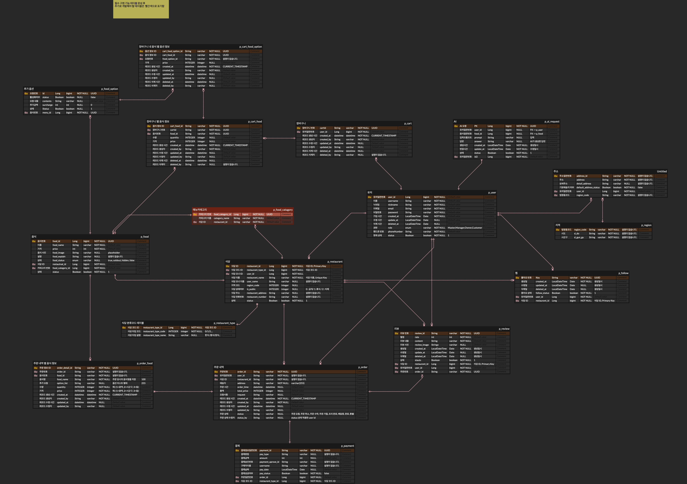

# 🍱 곧감 (GoatGam)
<br>

## ❇️ [프로젝트 개요](https://github.com/goatgam/goatgam/wiki)
#### 음식 주문과 배달을 효율적으로 관리하는 백엔드 중심 플랫폼
<details>
<summary>[ERD](https://www.erdcloud.com/d/7pvT5zGqZexdSBG7o)</summary>
- 
</details>
- [API 명세서](https://www.notion.so/27a2dc3ef51481629a77e7ef3666d515)

## 서비스 구성 및 실행방법
- [포팅 메뉴얼](https://www.notion.so/teamsparta/27e2dc3ef51480af9964e1b9a9435c43)

## 👨‍👩‍👧‍👦 팀원 소개
| <div align="center">[강은선](https://github.com/)</div> | <div align="center">[김현수](https://github.com/kinhyunsu)</div> | <div align="center">[정인규](https://github.com/JungInGyu)</div> | <div align="center">[김진현](https://github.com/)</div> | <div align="center">[홍태휘](https://github.com/)</div> | <div align="center">[한규원](https://github.com/akaneblue)</div>                                                                                         |
| :---------------------------------------------------------------------------- |:---------------------------------------------------------------------------------------------------------------------------------------------------------------------| :---------------------------------------------------------------------------- | :--------------------------------------------------------------------------- | :--------------------------------------------------------------------------- |:------------------------------------------------------------------------------------------------------------------------------------------------------|
| <div align="center"></div> | <div align="center"></div> | <div align="center"></div> | <div align="center"></div> | <div align="center"></div> | <div align="center"></div>                                                                     |
| <div align="center"> `장바구니` <br>장바구니 CRUD<br/>주문 내역 관리<br/>`공통`<br>예외 처리 핸들러<br>기능 검증 및 보완</div> | <div align="center"> `식당`<br> 식당 API 개발<br> 테스트 코드 작성<br> 카트 테스트<br>`공통`<br>코드 리뷰 </div> | <div align="center"> `팔로우 & 리뷰` <br> 팔로우 API 개발 <br> 리뷰 API 개발 <br> ERD 연관관계 정의<br>`테스트`<br>테스트 코드 작성 </div> | <div align="center"> `식당`<br> 식당 API 개발<br> 테스트 코드 작성<br>`공통`<br>예외 처리<br>문서화 </div> | <div align="center">`인증/인가`<br>JWT 인증 구현<br>Spring Security<br>`인프라`<br>AWS EC2/RDS/IAM<br>주소/지역 관리 </div> | <div align="center">`음식/옵션`<br>음식, 옵션 API 개발<br>`주문처리`<br>주문처리 구현<br>`AI`<br>AI서비스 구현<br>`결제`<br>결제 시스템 구현<br>`배포`<br>Docker<br>GitHub Actions </div> |

## 🚀 기술 스택

Category | Stack
--- | --- |
Language | 
IDE |  
Framework | 
Build Tool | 
Database | 
Library |    
API |   
DevOps |     
Tools |     

<details>
<summary><strong>📣기술 & 라이브러리 선정 이유</strong></summary>
<div markdown="1">   
  <br/>
  <details>
  <summary><strong> 1️⃣ Spring Boot 3.5.6</strong></summary>
    <div markdown="1"> 

    1. 자동 설정 기능으로 개발 생산성을 향상시킬 수 있습니다.
    2. 스타터 패키지를 통해 의존성 관리가 용이합니다.
    3. 내장 서버를 제공하여 별도의 WAS 설정 없이 바로 실행 가능합니다.
    4. 최신 버전으로 보안 패치와 성능 개선이 반영되어 있습니다.

  </details> 

  <details>
  <summary><strong> 2️⃣ PostgreSQL</strong></summary>
    <div markdown="1">     

    1. 무료로 제공되는 오픈소스 RDBMS입니다.
    2. 안정성과 확장성이 뛰어나며 대용량 데이터 처리에 적합합니다.
    3. JSON 타입 지원 등 다양한 데이터 타입을 제공합니다.
    4. ACID 특성을 완벽하게 지원하여 데이터 무결성을 보장합니다.

  </details> 

  <details>
  <summary><strong> 3️⃣ JWT & Spring Security</strong></summary>
    <div markdown="1">     

    1. Stateless한 인증 방식으로 서버 확장성이 좋습니다.
    2. Spring Security와의 완벽한 통합으로 보안 구현이 용이합니다.
    3. 토큰 기반 인증으로 세션 관리 부담이 없습니다.
    4. 역할 기반 접근 제어(RBAC)를 쉽게 구현할 수 있습니다.

  </details> 

  <details>
  <summary><strong> 4️⃣ Docker</strong></summary>
    <div markdown="1">

    1. 개발 환경과 운영 환경의 일관성을 유지할 수 있습니다.
    2. 격리된 환경에서 테스트가 가능하여 시스템 영향을 최소화합니다.
    3. 이미지 기반으로 빠른 배포가 가능합니다.
    4. 마이크로서비스 아키텍처로의 확장이 용이합니다.

  </details> 

  <details>
  <summary><strong> 5️⃣ GitHub Actions</strong></summary>
    <div markdown="1">     

    1. GitHub와 완벽하게 통합되어 별도의 CI/CD 도구 설정이 불필요합니다.
    2. YAML 파일로 간단하게 워크플로우를 정의할 수 있습니다.
    3. 자동화된 테스트와 배포로 개발 효율성을 높일 수 있습니다.
    4. 무료 티어에서도 충분한 빌드 시간을 제공합니다.

  </details> 

  <details>
  <summary><strong> 6️⃣ RestClient</strong></summary>
    <div markdown="1">     

    1. RestTemplate의 후속 버전으로 더 나은 성능과 유지보수성을 제공합니다.
    2. 동기 방식으로 구현이 간단하고 학습 곡선이 낮습니다.
    3. 예외 처리가 명확하고 직관적입니다.
    4. 현재 프로젝트 규모에서는 비동기보다 동기 방식이 더 적합합니다.

  </details> 

  <details>
  <summary><strong> 7️⃣ Google Gemini API</strong></summary>
    <div markdown="1">

    1. 메뉴 설명 자동 생성으로 사장님의 업무 부담을 줄일 수 있습니다.
    2. 자연스러운 한국어 생성이 가능합니다.
    3. API 호출이 간단하여 빠르게 통합할 수 있습니다.
    4. 무료 티어로 프로젝트 테스트가 가능합니다.

  </details> 

  <details>
  <summary><strong> 8️⃣ JUnit5 & Mockito</strong></summary>  
  <div markdown="1">     

    1. 단위 테스트 작성으로 코드 품질을 향상시킬 수 있습니다.
    2. Mock 객체를 통해 의존성을 격리하여 테스트할 수 있습니다.
    3. 테스트 자동화로 리팩토링 시 안전성을 확보할 수 있습니다.
    4. Spring Boot와의 통합이 우수합니다.

  </details> 

</div>
</details>
</br>

## 📁 아키텍처
```
곧감 아키텍처는 다음과 같이 구성됩니다:
- GitHub Actions를 통한 자동 빌드 및 테스트
- Docker 컨테이너화로 일관된 실행 환경 제공
- AWS EC2에 자동 배포
- PostgreSQL RDS로 데이터 관리
- EC2 인바운드 규칙을 통한 접근 제어
```

<br>


### 테이블 구조 (총 19개)
<details>
<summary><strong>상세 테이블 구조</strong></summary>

#### 👤 유저 관련 (4개)
- 유저 (Users)
- 주소 (Address)
- 지역 (Region)
- 찜 (Favorite)

#### 🏪 식당 관련 (6개)
- 식당 (Restaurant)
- 식당 분류 카테고리 (Category)
- 메뉴 (Menu)
- 음식 (Food)
- 추가 옵션 (FoodOption)
- 리뷰 (Review)

#### 🛒 장바구니 관련 (3개)
- 장바구니 (Cart)
- 장바구니 별 음식 정보 (CartFood)
- 장바구니 내 음식 별 옵션 정보 (CartFoodOption)

#### 📦 주문 관련 (3개)
- 주문 내역 (Order)
- 주문 내역 별 음식 정보 (OrderFood)
- 결제 (Payment)

#### 🤖 AI (1개)
- AI 로그 (AILog)

</details>

<br>


### 도메인 구성
```
✅ 인증/인가: JWT 기반 로그인/회원가입
✅ 주소 관리: 법정동 주소 데이터 연동, 사용자 주소 관리
✅ 식당/메뉴: 조회, 검색, 페이징, 사장님 전용 관리
✅ 장바구니: 담기/수정/삭제 및 합계 계산
✅ 주문/결제: 주문 생성/상태 관리, 결제 모듈 연동
✅ 리뷰/팔로우: 가게 리뷰 작성/조회, 팔로우 기반 피드
✅ AI: Google Gemini API를 활용한 메뉴 설명 생성
```

<br>

##  🛠 주요 기능
```
👨‍👩‍👧 유저: 로그인 | 회원가입 | JWT 인증 | 권한 관리
🏪 식당: 검색 | 조회 | 카테고리별 필터링 | 페이징 | 사장님 전용 관리
🍱 메뉴: 음식 조회 | 옵션 선택 | AI 설명 생성
🛒 장바구니: 담기 | 수정 | 삭제 | 합계 계산
📦 주문: 주문 생성 | 상태 관리 | 주문 내역 조회
💳 결제: 결제 처리 | 결제 내역 관리
⭐ 리뷰: 리뷰 작성 | 조회 | 평점 관리
❤️ 팔로우: 식당 팔로우 | 피드 조회
📍 주소: 주소 등록 | 관리 | 법정동 주소 연동
```

<details>
  <summary><strong>1️⃣ JWT 인증/인가</strong></summary>
  <br>

- [x] Spring Security와 JWT를 활용한 Stateless 인증
- [x] Customer와 Owner 역할 구분
- [x] 토큰 기반 인증으로 확장성 확보
- [x] @PreAuthorize를 통한 세밀한 권한 제어
</details>

<details>
  <summary><strong>2️⃣ 식당 관리</strong></summary>
  <br>

- [x] 카테고리별 식당 조회
- [x] 검색 및 페이징 기능
- [x] 사장님 전용 식당 등록/수정/삭제
- [x] 식당 상태 관리 (오픈/마감)
</details>

<details>
  <summary><strong>3️⃣ 장바구니 & 주문</strong></summary>
  <br>

- [x] 장바구니에 음식 및 옵션 추가
- [x] 장바구니 수정/삭제 기능
- [x] 주문 생성 및 상태 관리
- [x] 주문 내역 조회 및 상세 정보 확인
</details>

<details>
  <summary><strong>4️⃣ AI 메뉴 설명</strong></summary>
  <br>

- [x] Google Gemini API 연동
- [x] 메뉴명 기반 자동 설명 생성
- [x] 사장님의 업무 효율화
- [x] AI 호출 로그 저장
</details>

<details>
  <summary><strong>5️⃣ 리뷰 시스템</strong></summary>
  <br>

- [x] 배달 완료된 주문에 대한 리뷰 작성
- [x] 리뷰 수정/삭제 (Soft Delete)
- [x] 주문별 리뷰 관리
- [x] 리뷰 조회 기능
</details>

<details>
  <summary><strong>6️⃣ 주소 관리</strong></summary>
  <br>

- [x] 법정동 주소 데이터 CSV 로딩
- [x] 시도/시군구/법정동 계층 구조
- [x] 사용자별 주소 등록/관리
- [x] 기본 배송지 설정
</details>

<details>
  <summary><strong>7️⃣ 팔로우</strong></summary>
  <br>

- [x] 식당 팔로우/언팔로우
- [x] 팔로우한 식당 목록 조회
- [x] 팔로우 상태 확인
</details>

<br>

## ⭐ CI/CD
<details>
  <summary><strong> GitHub Actions</strong></summary>
    <div markdown="1"> 
      <h3>main 브랜치에 Push 시 자동으로 빌드/테스트/배포가 진행됩니다</h3>

      ```yaml
      - 코드 체크아웃
      - Gradle 빌드 및 테스트
      - Docker 이미지 빌드
      - EC2로 이미지 전송
      - 컨테이너 실행
      ```
      
      <p>✅ 테스트 통과 후 자동 배포</p>
      <p>✅ Docker를 통한 일관된 실행 환경</p>
      <p>✅ EC2에서 안정적인 서비스 제공</p>
</details>

<details>
  <summary><strong> Docker</strong></summary>
    <div markdown="1"> 
        <h3>Dockerfile을 통한 컨테이너 빌드로 환경 일관성 유지</h3>

        ```dockerfile
        FROM openjdk:17-jdk-slim
        COPY build/libs/*.jar app.jar
        ENTRYPOINT ["java","-jar","/app.jar"]
        ```
        
        <p>✅ 개발/운영 환경 동일화</p>
        <p>✅ 빠른 배포와 롤백</p>
</details>

</br>

## 🐞 Trouble Shooting

<details>
  <summary><strong>1️⃣ PostgreSQL 설치 오류 해결</strong></summary>
    <div markdown="1"> 

**문제**
- PostgreSQL을 로컬에 설치하는 과정에서 에러 코드 1 발생
- 설치 경로에 한글이 포함되어 설치 실패

**원인**
- 한글 경로로 인한 설치 오류

**해결 방안**
- DBeaver를 사용하여 원격 RDS에 직접 접근
- 로컬 설치 없이 개발 환경 구성

**결과**
- ✅ 팀원 모두 동일한 DB 환경에서 작업 가능
- ✅ 초기 환경 구축 시간 단축
- ✅ 경로 오류 근본적 해결

</details>

<details>
  <summary><strong>2️⃣ Spring Security 권한 거부 응답 개선</strong></summary>
    <div markdown="1"> 

**문제**
- `@PreAuthorize`로 권한 제어 시 403 에러만 반환
- Swagger에서 에러 상세 정보 확인 불가

**원인**
- 기본 `AccessDeniedHandler`가 HTML 기반 에러 페이지 반환
- API 클라이언트에서는 단순 403만 표시됨

**해결 방안**
- 커스텀 예외 처리 핸들러 구현
- JSON 형태의 상세 에러 응답 반환

**결과**
```json
{
  "status": 403,
  "error": "Forbidden",
  "message": "접근 권한이 없습니다.",
  "path": "/api/v1/user"
}
```
- ✅ 명확한 에러 메시지 제공
- ✅ 디버깅 효율 향상
- ✅ API 응답 일관성 확보

</details>

<details>
  <summary><strong>3️⃣ 주문 생성 시 다중 오류 해결</strong></summary>
    <div markdown="1"> 

**문제**
- POST `/api/orders` 호출 시 순차적 오류 발생
    1. `HttpMediaTypeNotAcceptableException`
    2. `HttpMessageNotReadableException`
    3. SQL NOT NULL 제약 조건 위반

**원인**
1. DTO에 getter 없어 JSON 변환 불가
2. `@RequestBody String` 타입 불일치
3. 클래스 레벨 `@Transactional(readOnly = true)`로 INSERT 무시
4. 엔티티와 DB 스키마 불일치

**해결 방안**
1. DTO를 `record`로 변경하여 자동 getter 생성
2. 요청 DTO 타입을 적절한 객체로 변경
3. 쓰기 메서드에 `@Transactional` 오버라이드
4. DB 스키마와 엔티티 동기화

**결과**
- ✅ JSON 직렬화/역직렬화 정상 작동
- ✅ 트랜잭션 정상 커밋
- ✅ 불필요한 컬럼 제거
- ✅ 안정적인 주문 생성 기능

</details>

<details>
  <summary><strong>4️⃣ 회원가입 시 인증 정보 오류</strong></summary>
    <div markdown="1"> 

**문제**
- 회원가입 시 `UserDetailsImpl` 캐스팅 오류 발생
- SecurityContextHolder가 인증정보를 찾지 못함

**원인**
- 회원가입은 인증 없이 접근 가능한 API
- principal이 "anonymous" 문자열이라 캐스팅 불가

**해결 방안**
```java
if (principal instanceof UserDetailsImpl) {
    return ((UserDetailsImpl) principal).getUsername();
}
return "SYSTEM";
```

**결과**
- ✅ 미인증 사용자 작업 시 "SYSTEM" 기록
- ✅ 인증된 사용자는 닉네임 기록
- ✅ created_by, updated_by 추적 가능

</details>

<details>
  <summary><strong>5️⃣ Soft Delete 데이터 조회 문제</strong></summary>
    <div markdown="1"> 

**문제**
- Cart 조회 시 삭제된 CartFood와 CartFoodOption까지 조회됨
- Soft Delete한 데이터가 함께 반환됨

**원인**
- 연관 엔티티에 조회 조건이 적용되지 않음
- `is_deleted = true`인 데이터까지 전부 조회

**해결 방안**
```java
@OneToMany(mappedBy = "cart")
@SQLRestriction("is_deleted = false")
private List<CartFood> cartFoods;
```

**결과**
- ✅ 삭제되지 않은 데이터만 조회
- ✅ 데이터 정합성 유지
- ✅ 불필요한 필터링 로직 제거

</details>

<details>
  <summary><strong>6️⃣ 장바구니 음식 추가 시 ID 미생성 오류</strong></summary>
    <div markdown="1"> 

**문제**
- 새 장바구니 생성 후 음식 추가 시 오류 발생
- 외래키 참조 실패

**원인**
- `Cart.create()`로 생성한 엔티티를 저장하지 않고 사용
- ID가 생성되지 않은 상태에서 참조 시도

**해결 방안**
```java
Cart newCart = Cart.create(user, restaurant);
cartRepository.save(newCart); // 저장 후 사용
```

**결과**
- ✅ 안전한 데이터 저장 및 조회
- ✅ 외래키 참조 정상 작동
- ✅ 장바구니 기능 안정화

</details>

<details>
  <summary><strong>7️⃣ 식당 정보 접근 권한 문제</strong></summary>
    <div markdown="1"> 

**문제**
- 식당 등록/수정/삭제 시 본인 확인 없이 접근 가능
- 다른 사장님의 식당 정보 수정 가능

**원인**
- 본인 ID 체크 로직 부재
- 권한만 확인하고 소유권은 미확인

**해결 방안**
```java
if (!restaurant.getOwnerId().equals(user.getId())) {
    throw new UnauthorizedException("본인의 식당만 수정 가능합니다");
}
```

**결과**
- ✅ 본인 식당만 관리 가능
- ✅ 권한과 소유권 이중 검증
- ✅ 데이터 보안 강화

</details>

<details>
  <summary><strong>8️⃣ 리뷰 재작성 시 Unique 제약 조건 위반</strong></summary>
    <div markdown="1"> 

**문제**
- 리뷰 작성 → 삭제 → 재작성 시 오류 발생
- Soft Delete로 인해 실제 데이터는 남아있어 Unique 제약 위반

**원인**
- 주문과 리뷰가 1:1 관계
- 외래키에 Unique 제약 조건 존재

**해결 방안**
1. 주문과 리뷰 관계를 1:N으로 변경
2. 리뷰 생성 시 활성 상태 확인 로직 추가
```java
if (reviewRepository.existsByOrderIdAndStatusTrue(orderId))